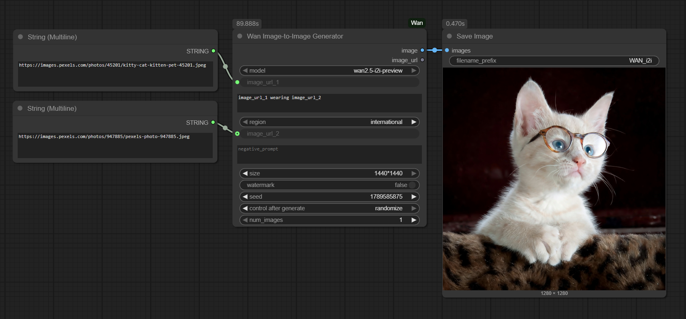

# ComfyUI_Wan

[](LICENSE)


A custom node for ComfyUI that provides **seamless integration** with the **Wan models** from **Alibaba Cloud Model Studio**. This solution delivers cutting-edge image and video generation capabilities directly within ComfyUI, supporting both international and Mainland China regions.

### Why Choose Alibaba Cloud Model Studio?

This is a direct integration with Alibaba Cloud's Model Studio service, not a third-party wrapper or local model implementation. Benefits include:

- **Enterprise-Grade Infrastructure**: Leverages Alibaba Cloud's battle-tested AI platform serving millions of requests daily
- **State-of-the-Art Models**: Access to the latest Wan models with continuous updates:
  - **Text-to-Image**: wan2.5-t2i-preview (Preview Edition), wan2.2-t2i-flash (Speed Edition), wan2.2-t2i-plus (Professional Edition), wanx2.1-t2i-turbo (Turbo Edition), wanx2.1-t2i-plus (Plus Edition), wanx2.0-t2i-turbo (Turbo Edition)
  - **Image-to-Video**: wan2.5-i2v-preview (Preview Edition), wan2.2-i2v-flash (Speed Edition), wan2.2-i2v-plus (Professional Edition)
  - **Image-to-Video Effects**: wan2.1-i2v-plus (Professional Edition)
  - **Text-to-Video**: wan2.5-t2v-preview (Preview Edition), wan2.2-t2v-plus (Professional Edition), wanx2.1-t2v-turbo (Turbo Edition), wanx2.1-t2v-plus (Plus Edition)
  - **Image-to-Video (First/Last Frames)**: wan2.1-kf2v-plus (Professional Edition)
  - **Universal Video Editing (VACE)**: wan2.1-vace-plus (Professional Edition) - Split into 5 specialized nodes for better usability
- **Commercial Licensing**: Properly licensed for commercial use through Alibaba Cloud's terms of service
- **Scalable Architecture**: Handles high-volume workloads with Alibaba Cloud's reliable infrastructure
- **Security Compliance**: Follows Alibaba Cloud's security best practices with secure API key management
- **Enhanced Output Options**: All video generation nodes now return both local file paths and remote URLs for flexible workflow integration

## Important: API Costs & Authorization

⚠️ **This is a paid service**: The Wan models are provided through Alibaba Cloud's commercial API and incur usage costs. You will be billed according to Alibaba Cloud's pricing model based on your usage.

 **Model Authorization Required**: If you're using a non-default workspace or project in Alibaba Cloud, you may need to explicitly authorize access to the Wan models in your DashScope console.

## Regional Support

This node supports both international and Mainland China Alibaba Cloud regions. To switch regions, simply select "international" or "mainland_china" from the "region" dropdown parameter available in all nodes. The node will automatically use the appropriate API endpoint and API key for the selected region.

**Note**: If you want to use the Mainland China region, you must have a separate API key for that region. Make sure to set both `DASHSCOPE_API_KEY` (for international) and `DASHSCOPE_API_KEY_CHINA` (for Mainland China) in your `.env` file.

## Centralized Endpoint Management

All API endpoints are centrally managed in the `core/base.py` file, making it easy to maintain and switch between regions. This approach ensures consistency across all nodes and simplifies future updates.

## Available Nodes

| Node Name | Function | Model | Description |
|-----------|----------|-------|-------------|
| Wan Text-to-Image Generator | T2I | wan2.5-t2i-preview, wan2.2-t2i-flash, wan2.2-t2i-plus, wanx2.1-t2i-turbo, wanx2.1-t2i-plus, wanx2.0-t2i-turbo | Generate images from text prompts with multiple resolution options. Returns both image tensor and image URL. |
| Wan Image-to-Image Generator | I2I | wan2.5-i2i-preview | Edit images using text prompts and reference images with multiple size options. Returns both image tensor and image URL. |
| Wan Image-to-Video Generator | I2V | wan2.5-i2v-preview, wan2.2-i2v-flash, wan2.2-i2v-plus | Create 5-second videos from a single image and text prompt. Returns both video file path and video URL. |
| Wan Image-to-Video Effect Generator | I2V Effect | wan2.1-i2v-plus | Generate videos with predefined effects from a single image. Returns both video file path and video URL. |
| Wan Text-to-Video Generator | T2V | wan2.5-t2v-preview, wan2.2-t2v-plus, wanx2.1-t2v-turbo, wanx2.1-t2v-plus | Generate 5-second videos directly from text prompts. Returns both video file path and video URL. |
| Wan Image-to-Video (First/Last Frame) Generator | II2V | wan2.1-kf2v-plus | Create 5-second videos using both first and last frame images. Returns both video file path and video URL. |
| Wan VACE - Multi-Image Reference | VACE | wan2.1-vace-plus | Generate videos from multiple reference images. Returns both video file path and video URL. |
| Wan VACE - Video Repainting | VACE | wan2.1-vace-plus | Repaint videos while preserving motion. Returns both video file path and video URL. |
| Wan VACE - Local Video Editing | VACE | wan2.1-vace-plus | Locally edit specific areas of videos. Returns both video file path and video URL. |
| Wan VACE - Video Extension | VACE | wan2.1-vace-plus | Extend videos with additional content. Returns both video file path and video URL. |
| Wan VACE - Video Outpainting | VACE | wan2.1-vace-plus | Scale videos in different directions. Returns both video file path and video URL. |
| Wan Image-to-Video Effect Generator | I2V Effect | wan2.1-i2v-plus | Generate videos with predefined effects from a single image. Returns both video file path and video URL. |

## Features

- **Regional Support**: Works with both international and Mainland China Alibaba Cloud regions
- **Configurable Parameters**: Seed, resolution, prompt extension, watermark, negative prompts, and more
- **Specialized VACE Nodes**: The Universal Video Editing (VACE) model has been split into 5 specialized nodes for better usability and focused functionality
- **Powered by Alibaba Cloud's Advanced Wan Models**: Access to state-of-the-art models with continuous updates
- **Dual Output Support**: All video generation nodes now return both local file paths and remote URLs for flexible workflow integration
- **Video Effects Generation**: Create videos with predefined effects using the Image-to-Video Effect Generator node

## Installation

1. Clone this repository to your ComfyUI custom nodes directory:
   ```
   cd ComfyUI/custom_nodes
   git clone https://github.com/ru4ls/ComfyUI_Wan.git
   ```

2. Install the required dependencies:
   ```
   pip install -r ComfyUI_Wan/requirements.txt
   ```

## Setup

### Obtain API Key

1. Visit [Alibaba Cloud Model Studio](https://dashscope.console.aliyuncs.com/apiKey) to get your API key
2. Create an account if you don't have one
3. Generate a new API key

### Model Authorization (If Using Non-Default Workspace)

If you're using a workspace other than your default workspace, you may need to authorize the models:

1. Go to the [DashScope Model Management Console](https://dashscope.console.aliyuncs.com/model)
2. Find the Wan models you want to use
3. Click "Authorize" or "Subscribe" for each model
4. Select your workspace/project if prompted

### Set Environment Variable

Copy the `.env.template` file to `.env` in your `config` directory and replace the placeholders with your actual API keys:

```
# For international region (default)
DASHSCOPE_API_KEY=your_actual_api_key_here

# For mainland China region (optional, if you have a separate key for China)
DASHSCOPE_API_KEY_CHINA=your_china_api_key_here
```

If you only use the international region, you only need to set `DASHSCOPE_API_KEY`. If you plan to use both regions, you should set both keys. The nodes will automatically use the appropriate key based on the region you select.

## Node Parameters

### Text-to-Image Generator
- **model**: Select the Wan model to use (wan2.5-t2i-preview, wan2.2-t2i-flash, wan2.2-t2i-plus, wanx2.1-t2i-turbo, wanx2.1-t2i-plus, wanx2.0-t2i-turbo)
- **prompt** (required): The text prompt for image generation
- **size**: Output image resolution (1024×1024, 1152×896, 896×1152, 1280×720, 720×1280, 1440×512, 512×1440)
- **negative_prompt**: Text describing content to avoid in the image
- **prompt_extend**: Enable intelligent prompt rewriting for better results
- **seed**: Random seed for generation (0 for random)
- **watermark**: Add Wan watermark to output

**Return Values:**
- **image**: Generated image as a tensor (can be connected directly to other ComfyUI nodes)
- **image_url**: URL of the generated image on Alibaba Cloud's servers

### Image-to-Image Generator
- **model**: Select the Wan model to use (wan2.5-i2i-preview)
- **image_url_1** (required): Publicly accessible URL to the first input image for editing
- **image_url_2** (optional): Publicly accessible URL to the second reference image (for multi-reference generation)
- **prompt** (required): The text prompt describing the desired changes to the image
- **size**: Output image resolution (1024×1024, 1152×896, 896×1152, 1280×720, 720×1280, 1440×512, 512×1440)
- **negative_prompt**: Text describing content to avoid in the edited image
- **watermark**: Add Wan watermark to output
- **seed**: Random seed for generation (0 for random)
- **num_images**: Number of images to generate (1-4)

**Return Values:**
- **image**: Generated image as a tensor (can be connected directly to other ComfyUI nodes)
- **image_url**: URL of the generated image on Alibaba Cloud's servers

### Text-to-Video Generator
- **model**: Select the Wan model to use (wan2.5-t2v-preview, wan2.2-t2v-plus, wanx2.1-t2v-turbo, wanx2.1-t2v-plus)
- **prompt** (required): The text prompt for video generation
- **resolution**: Output video resolution (480P, 720P, 1080P)
- **negative_prompt**: Text describing content to avoid in the video
- **prompt_extend**: Enable intelligent prompt rewriting for better results
- **seed**: Random seed for generation (0 for random)
- **watermark**: Add Wan watermark to output
- **output_dir**: Directory where the generated video will be saved. Can be browsed and selected in ComfyUI.

**Return Values:**
- **video_file_path**: Path to the downloaded video file on your local system
- **video_url**: URL of the generated video on Alibaba Cloud's servers

**Note**: To preview the generated video in ComfyUI, connect the output of this node to a "Load Video (Path)" node from ComfyUI-VideoHelperSuite.

### Image-to-Video Generator
- **model**: Select the Wan model to use (wan2.5-i2v-preview, wan2.2-i2v-flash, wan2.2-i2v-plus)
- **image_url**: Publicly accessible URL to the image for the first frame of the video
- **prompt** (required): The text prompt describing the video content
- **resolution**: Output video resolution (480P, 720P, 1080P)
- **negative_prompt**: Text describing content to avoid in the video
- **prompt_extend**: Enable intelligent prompt rewriting for better results
- **seed**: Random seed for generation (0 for random)
- **watermark**: Add Wan watermark to output
- **output_dir**: Directory where the generated video will be saved. Can be browsed and selected in ComfyUI.

**Return Values:**
- **video_file_path**: Path to the downloaded video file on your local system
- **video_url**: URL of the generated video on Alibaba Cloud's servers

**Note**: To preview the generated video in ComfyUI, connect the output of this node to a "Load Video (Path)" node from ComfyUI-VideoHelperSuite.

### Image-to-Video (First/Last Frame) Generator
- **model**: Select the Wan model to use (wan2.1-kf2v-plus)
- **first_frame_url**: Publicly accessible URL to the first frame image
- **last_frame_url**: Publicly accessible URL to the last frame image
- **prompt** (required): The text prompt describing the video content and transition
- **resolution**: Output video resolution (720P)
- **negative_prompt**: Text describing content to avoid in the video
- **prompt_extend**: Enable intelligent prompt rewriting for better results
- **seed**: Random seed for generation (0 for random)
- **watermark**: Add Wan watermark to output
- **output_dir**: Directory where the generated video will be saved. Can be browsed and selected in ComfyUI.

**Return Values:**
- **video_file_path**: Path to the downloaded video file on your local system
- **video_url**: URL of the generated video on Alibaba Cloud's servers

**Note**: To preview the generated video in ComfyUI, connect the output of this node to a "Load Video (Path)" node from ComfyUI-VideoHelperSuite.

### Wan VACE - Multi-Image Reference
This node generates videos from multiple reference images using the Wan VACE model.

**Parameters:**
- **model**: Select the Wan model to use (wan2.1-vace-plus)
- **prompt** (required): The text prompt describing the desired video content
- **ref_images_url** (required): Newline-separated URLs for reference images
- **obj_or_bg** (optional): Newline-separated values (obj/bg) corresponding to ref_images_url. 
  - If not provided, the node automatically assigns "obj" to all images except the last one, which is assigned "bg"
  - Example: For 3 images, it automatically becomes ["obj", "obj", "bg"]
- **size**: Output video resolution (1280*720, 720*1280, 960*960, 832*1088, 1088*832)
- **seed**: Random seed for generation (0 for random)
- **prompt_extend**: Enable intelligent prompt rewriting for better results
- **watermark**: Add Wan watermark to output
- **output_dir**: Directory where the generated video will be saved. Can be browsed and selected in ComfyUI.

**Automatic obj_or_bg Handling:**
The node intelligently handles the obj_or_bg parameter:
- For a single reference image: Automatically set to ["obj"]
- For multiple reference images: Automatically set to ["obj", "obj", ..., "bg"] where the last image is treated as background

**Return Values:**
- **video_file_path**: Path to the downloaded video file on your local system
- **video_url**: URL of the generated video on Alibaba Cloud's servers

**Note**: To preview the generated video in ComfyUI, connect the output of this node to a "Load Video (Path)" node from ComfyUI-VideoHelperSuite.

### Wan VACE - Video Repainting
This node repaints videos while preserving motion using the Wan VACE model.

**Parameters:**
- **model**: Select the Wan model to use (wan2.1-vace-plus)
- **prompt** (required): The text prompt describing the desired video content
- **video_url** (required): URL of the input video to repaint
- **ref_images_url** (optional): Newline-separated URLs for reference images (only 1 image supported)
- **control_condition**: Method for video feature extraction (posebodyface, posebody, depth, scribble)
- **strength**: Control strength of the video feature extraction method (0.0-1.0, default: 1.0)
- **seed**: Random seed for generation (0 for random)
- **prompt_extend**: Enable intelligent prompt rewriting for better results
- **watermark**: Add Wan watermark to output
- **output_dir**: Directory where the generated video will be saved. Can be browsed and selected in ComfyUI.

**Return Values:**
- **video_file_path**: Path to the downloaded video file on your local system
- **video_url**: URL of the generated video on Alibaba Cloud's servers

**Note**: To preview the generated video in ComfyUI, connect the output of this node to a "Load Video (Path)" node from ComfyUI-VideoHelperSuite.

### Wan VACE - Local Video Editing
This node locally edits specific areas of videos using the Wan VACE model.

**Parameters:**
- **model**: Select the Wan model to use (wan2.1-vace-plus)
- **prompt** (required): The text prompt describing the desired video content
- **video_url** (required): URL of the input video to edit
- **ref_images_url** (optional): Newline-separated URLs for reference images (only 1 image supported)
- **mask_image_url** (optional): URL of the mask image
- **mask_frame_id** (optional): Frame ID where the masked object appears (default: 1)
- **mask_video_url** (optional): URL of the mask video
- **control_condition** (optional): Method for video feature extraction (posebodyface, posebody, depth, scribble)
- **mask_type**: Behavior of the editing area (tracking, fixed)
- **expand_ratio**: Ratio for expanding the mask area outward (0.0-1.0, default: 0.05)
- **expand_mode**: Shape of the mask area (hull, bbox, original)
- **size**: Output video resolution (1280*720, 720*1280, 960*960, 832*1088, 1088*832)
- **seed**: Random seed for generation (0 for random)
- **prompt_extend**: Enable intelligent prompt rewriting for better results
- **watermark**: Add Wan watermark to output
- **output_dir**: Directory where the generated video will be saved. Can be browsed and selected in ComfyUI.

**Return Values:**
- **video_file_path**: Path to the downloaded video file on your local system
- **video_url**: URL of the generated video on Alibaba Cloud's servers

**Note**: To preview the generated video in ComfyUI, connect the output of this node to a "Load Video (Path)" node from ComfyUI-VideoHelperSuite.

### Wan VACE - Video Extension
This node extends videos with additional content using the Wan VACE model.

**Parameters:**
- **model**: Select the Wan model to use (wan2.1-vace-plus)
- **prompt** (required): The text prompt describing the desired video content
- **first_frame_url** (optional): URL of the first frame image
- **last_frame_url** (optional): URL of the last frame image
- **first_clip_url** (optional): URL of the first video segment
- **last_clip_url** (optional): URL of the last video segment
- **video_url** (optional): URL of the reference video for motion features
- **control_condition** (optional): Method for video feature extraction (posebodyface, posebody, depth, scribble)
- **seed**: Random seed for generation (0 for random)
- **prompt_extend**: Enable intelligent prompt rewriting for better results
- **watermark**: Add Wan watermark to output
- **output_dir**: Directory where the generated video will be saved. Can be browsed and selected in ComfyUI.

**Return Values:**
- **video_file_path**: Path to the downloaded video file on your local system
- **video_url**: URL of the generated video on Alibaba Cloud's servers

**Note**: To preview the generated video in ComfyUI, connect the output of this node to a "Load Video (Path)" node from ComfyUI-VideoHelperSuite.

### Wan VACE - Video Outpainting
This node scales videos in different directions using the Wan VACE model.

**Parameters:**
- **model**: Select the Wan model to use (wan2.1-vace-plus)
- **prompt** (required): The text prompt describing the desired video content
- **video_url** (required): URL of the input video to outpaint
- **top_scale**: Scale upward proportionally (1.0-2.0, default: 1.0)
- **bottom_scale**: Scale downward proportionally (1.0-2.0, default: 1.0)
- **left_scale**: Scale to the left proportionally (1.0-2.0, default: 1.0)
- **right_scale**: Scale to the right proportionally (1.0-2.0, default: 1.0)
- **seed**: Random seed for generation (0 for random)
- **prompt_extend**: Enable intelligent prompt rewriting for better results
- **watermark**: Add Wan watermark to output
- **output_dir**: Directory where the generated video will be saved. Can be browsed and selected in ComfyUI.

**Return Values:**
- **video_file_path**: Path to the downloaded video file on your local system
- **video_url**: URL of the generated video on Alibaba Cloud's servers

**Note**: To preview the generated video in ComfyUI, connect the output of this node to a "Load Video (Path)" node from ComfyUI-VideoHelperSuite.

### Wan Image-to-Video Effect Generator
This node generates videos with predefined effects from a single image using the Wan model.

**Important**: This feature is only supported in the Mainland China region.

**Parameters:**
- **model**: Select the Wan model to use (wan2.1-i2v-plus)
- **image_url** (required): Publicly accessible URL to the image for the first frame of the video
- **template** (required): Predefined effect template to apply (e.g., "flying", "rose", "dance1", etc.)
- **region**: Select the region (mainland_china for effects)
- **resolution**: Output video resolution (480P, 720P, 1080P)
- **seed**: Random seed for generation (0 for random)
- **output_dir**: Directory where the generated video will be saved. Can be browsed and selected in ComfyUI.

**Available Templates:**
- squish, rotation, poke, inflate, dissolve, carousel, singleheart
- dance1, dance2, dance3, mermaid, graduation, dragon, money
- flying, rose, crystalrose, hug, frenchkiss, coupleheart

**Return Values:**
- **video_file_path**: Path to the downloaded video file on your local system
- **video_url**: URL of the generated video on Alibaba Cloud's servers

**Note**: To preview the generated video in ComfyUI, connect the output of this node to a "Load Video (Path)" node from ComfyUI-VideoHelperSuite.

## Examples

Prompt: "Generate an image of a cat"


Prompt: "Image_url_1 wearing Image_url_2"



## Security

The API key is loaded from the `DASHSCOPE_API_KEY` environment variable and never stored in files or code, following Alibaba Cloud security best practices.

## Changelog

### v1.3.0 - Image-to-Image Support
- Added new Wan Image-to-Image Generator node supporting wan2.5-i2i-preview model
- Implemented complete i2i functionality with multi-image reference support
- Added i2i API endpoint to core/base.py for proper communication
- Updated documentation with new node and its parameters
- Enhanced Available Nodes table to include Image-to-Image capabilities

### v1.2.0 - Model Updates
- Added new Wan2.5 Preview models: wan2.5-t2i-preview, wan2.5-i2v-preview, wan2.5-t2v-preview
- Added WanX models: wanx2.1-t2i-turbo, wanx2.1-t2i-plus, wanx2.1-t2v-turbo, wanx2.1-t2v-plus, wanx2.0-t2i-turbo
- Updated model lists across all generator nodes (T2I, I2V, T2V) to include the latest Wan models
- Enhanced documentation with updated model information and capabilities

### v1.1.0 - Region Selection Feature
- Added region selection parameter to all nodes, allowing users to easily switch between international and Mainland China regions
- Updated `.env.template` to include separate API key variables for international and Mainland China regions
- Modified `core/base.py` to support automatic endpoint and API key selection based on region
- Updated all generator nodes (T2I, I2V, T2V, II2V) and VACE nodes to include region selection
- Added new "Wan Image-to-Video Effect Generator" node for creating videos with predefined effects
- Improved documentation with updated setup instructions and regional support information

### v1.0.0 - Initial Release
- Initial release with full Wan model integration
- Support for Text-to-Image, Image-to-Video, Text-to-Video, and Image-to-Video (First/Last Frame) generation
- Full VACE model integration with 5 specialized nodes for video editing
- Dual output support (local file paths and remote URLs) for all video generation nodes
- International and Mainland China region support (manual configuration required)

## License

This project is licensed under the MIT License - see the [LICENSE](LICENSE) file for details.