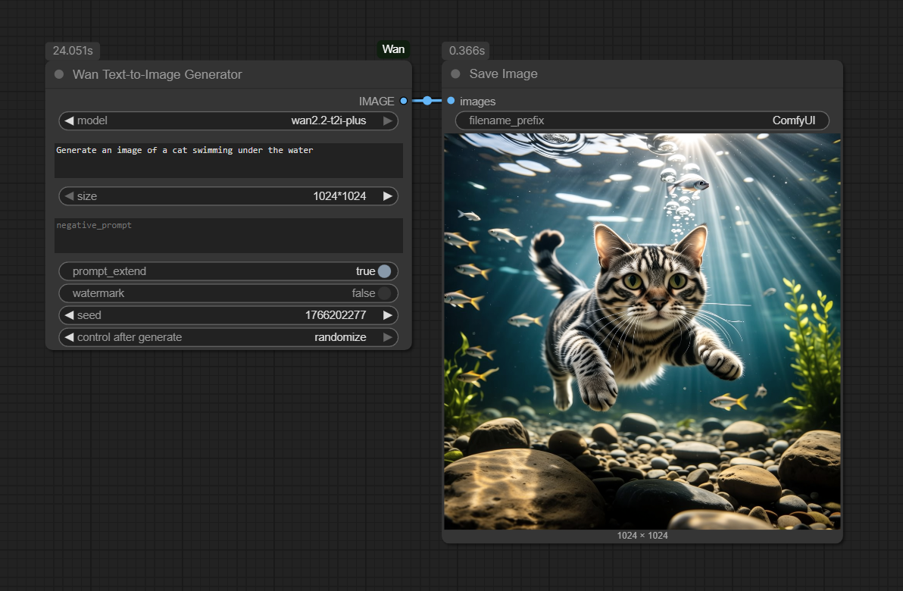
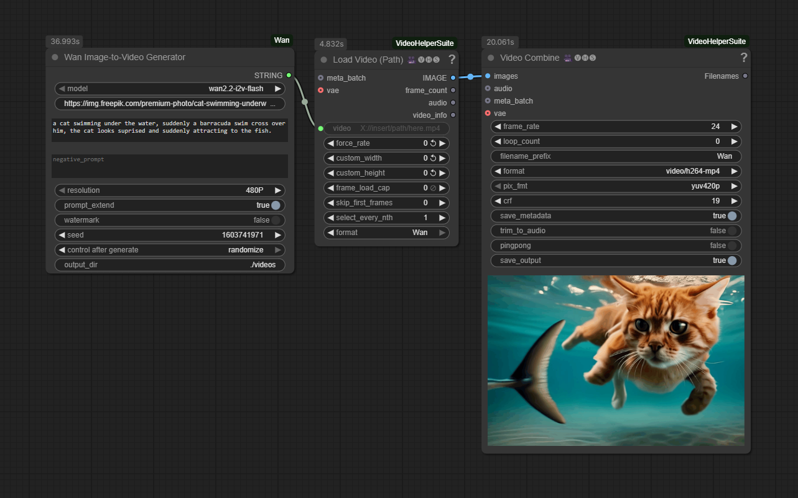

# ComfyUI_Wan

[](LICENSE)


A custom node for ComfyUI that provides **seamless integration** with the **Wan models** (text-to-image and image-to-video) from **Alibaba Cloud Model Studio**. This solution delivers cutting-edge image and video generation capabilities directly within ComfyUI.

### Why Choose Alibaba Cloud Model Studio?

This is a direct integration with Alibaba Cloud's Model Studio service, not a third-party wrapper or local model implementation. Benefits include:

- **Enterprise-Grade Infrastructure**: Leverages Alibaba Cloud's battle-tested AI platform serving millions of requests daily
- **State-of-the-Art Models**: Access to the latest Wan models (wan2.2-t2i-flash, wan2.2-t2i-plus, wan2.2-i2v-flash, wan2.2-i2v-plus) with continuous updates
- **Commercial Licensing**: Properly licensed for commercial use through Alibaba Cloud's terms of service
- **Scalable Architecture**: Handles high-volume workloads with Alibaba Cloud's reliable infrastructure
- **Security Compliance**: Follows Alibaba Cloud's security best practices with secure API key management

## Important: API Costs & Authorization

⚠️ **This is a paid service**: The Wan models are provided through Alibaba Cloud's commercial API and incur usage costs. You will be billed according to Alibaba Cloud's pricing model based on your usage.

 **Model Authorization Required**: If you're using a non-default workspace or project in Alibaba Cloud, you may need to explicitly authorize access to the Wan models in your DashScope console.

## Features

- Generate images from text T2I using Wan models with selectable model types
- Generate 5-second videos from images and text prompts (I2V) using Wan models
- Configurable parameters: seed, resolution, prompt extension, watermark, negative prompts
- Powered by Alibaba Cloud's advanced Wan models

## Installation

1. Clone this repository to your ComfyUI custom nodes directory:
   ```
   cd ComfyUI/custom_nodes
   git clone https://github.com/ru4ls/ComfyUI_Wan.git
   ```

2. Install the required dependencies:
   ```
   pip install -r ComfyUI_Wan/requirements.txt
   ```

## Setup

### Obtain API Key

1. Visit [Alibaba Cloud Model Studio](https://dashscope.console.aliyuncs.com/apiKey) to get your API key
2. Create an account if you don't have one
3. Generate a new API key

### Model Authorization (If Using Non-Default Workspace)

If you're using a workspace other than your default workspace, you may need to authorize the models:

1. Go to the [DashScope Model Management Console](https://dashscope.console.aliyuncs.com/model)
2. Find the Wan models you want to use
3. Click "Authorize" or "Subscribe" for each model
4. Select your workspace/project if prompted

### Set Environment Variable

Copy the `.env.template` file to `.env` in your ComfyUI root directory and replace the placeholder with your actual API key:
```
DASHSCOPE_API_KEY=your_actual_api_key_here
```

## Usage

### Text-to-Image Generation

1. Add the "Wan Text-to-Image Generator" node to your workflow
2. Select the desired model (wan2.2-t2i-flash or wan2.2-t2i-plus)
3. Connect a text input with your prompt
4. Configure parameters as needed (seed, resolution, etc.)
5. Execute the node

### Image-to-Video Generation

1. Add the "Wan Image-to-Video Generator" node to your workflow
2. Provide a publicly accessible URL to the image you want to use as the first frame of your video
3. Select the desired model (wan2.2-i2v-flash or wan2.2-i2v-plus)
4. Connect a text input with your prompt describing the video content
5. Optionally configure the output directory where the video will be saved (can be browsed in ComfyUI)
6. Execute the node
7. The node will return a path to the downloaded video file
8. To preview the video, connect the output to a "Load Video (Path)" node from ComfyUI-VideoHelperSuite

**Note**: The image URL must be publicly accessible (not behind authentication or on localhost). 
You can use services like Imgur, cloud storage providers, or your own web server to host the image.

## Node Parameters

### Text-to-Image Generator
- **model**: Select the Wan model to use (wan2.2-t2i-flash or wan2.2-t2i-plus)
- **prompt** (required): The text prompt for image generation
- **size**: Output image resolution (1024×1024, 1152×896, 896×1152, 1280×720, 720×1280, 1440×512, 512×1440)
- **negative_prompt**: Text describing content to avoid in the image
- **prompt_extend**: Enable intelligent prompt rewriting for better results
- **seed**: Random seed for generation (0 for random)
- **watermark**: Add Wan watermark to output

### Image-to-Video Generator
- **model**: Select the Wan model to use (wan2.2-i2v-flash or wan2.2-i2v-plus)
- **image_url**: Publicly accessible URL to the image for the first frame of the video
- **prompt** (required): The text prompt describing the video content
- **resolution**: Output video resolution (480P, 720P, 1080P)
- **negative_prompt**: Text describing content to avoid in the video
- **prompt_extend**: Enable intelligent prompt rewriting for better results
- **seed**: Random seed for generation (0 for random)
- **watermark**: Add Wan watermark to output
- **output_dir**: Directory where the generated video will be saved. Can be browsed and selected in ComfyUI.

**Note**: To preview the generated video in ComfyUI, connect the output of this node to a "Load Video (Path)" node from ComfyUI-VideoHelperSuite.

## Examples

### Text-to-Image Generation
Prompt: "Generate an image of a cat swimming under the water"



### Image-to-Video Generation
1. First frame: Provide a URL to an image (e.g., "https://example.com/your_image.png")
2. Prompt: "a cat swimming under the water, suddenly a barracuda swim cross over him, the cat looks suprised and suddenly attracting to the fish."
3. Output directory: "./videos" (default) or any custom path
4. To preview: Connect the output to a "Load Video (Path)" node from ComfyUI-VideoHelperSuite



## Security

The API key is loaded from the `DASHSCOPE_API_KEY` environment variable and never stored in files or code, following Alibaba Cloud security best practices.

## License

This project is licensed under the MIT License - see the [LICENSE](LICENSE) file for details.